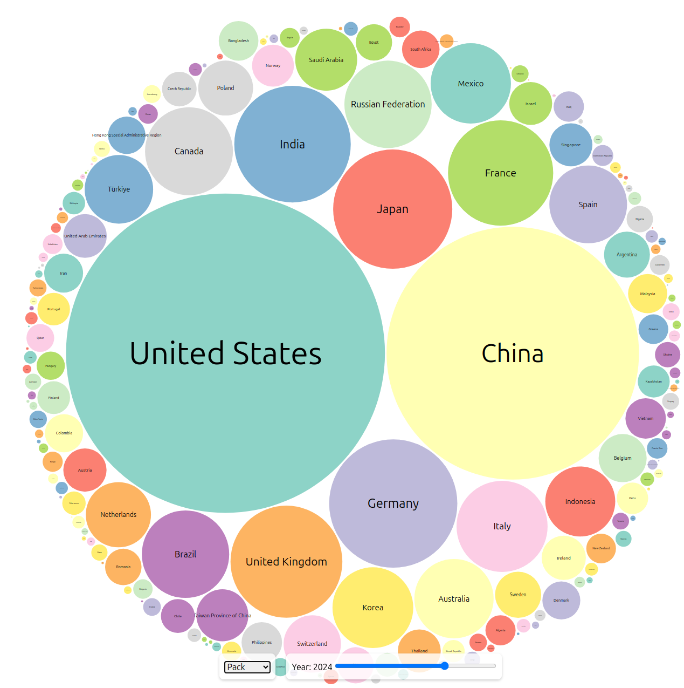

Quick d3js project using treemap/pack.

[ndelor.me/imf](https://www.ndelor.me/imf)

This example offers vizualization of the 2015-2028 IMF `Gross domestic product (GDP), Current prices, US Dollar`

https://betadata.imf.org/en/Search-Results#q=gdp&t=coveob02de888&sort=relevancy&f:idata_topic=[Gross%20domestic%20product%20(GDP)]
